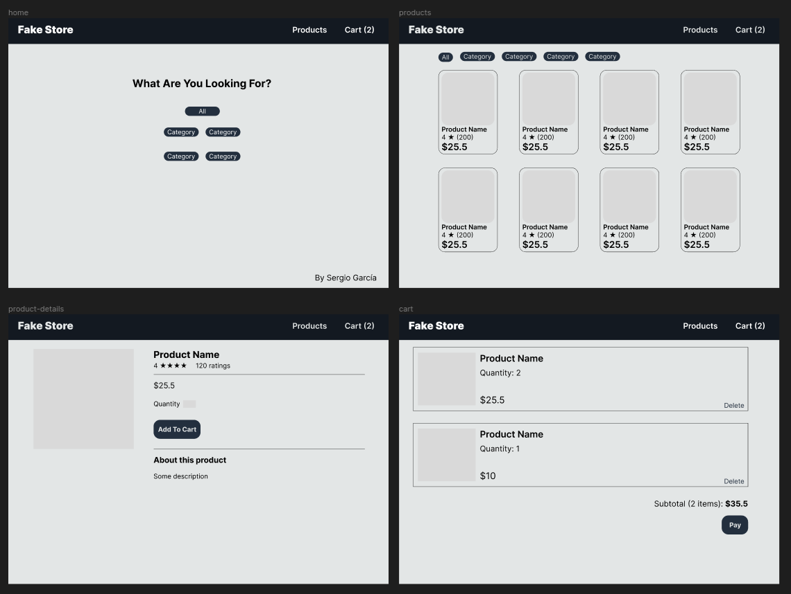
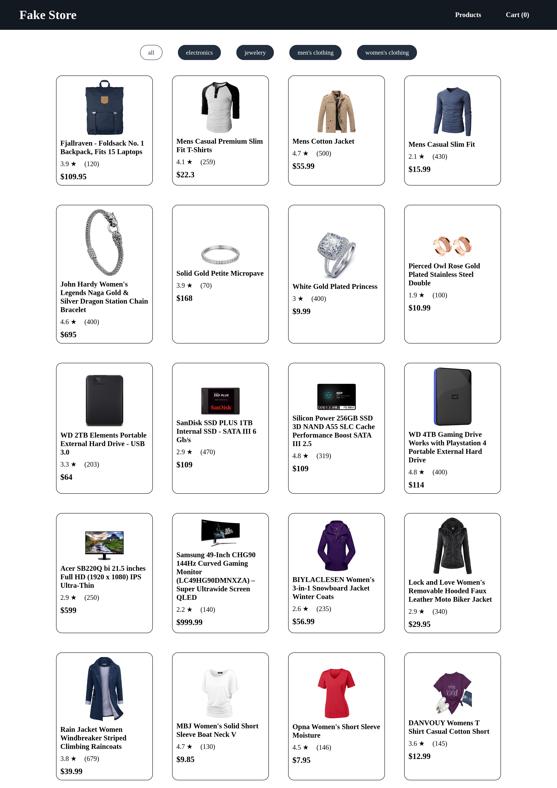

# fake-store
A fake store created with React to practice testing.

## About the App

This project is from [The Odin Project](https://www.theodinproject.com/lessons/node-path-react-new-shopping-cart) curriculum.

### Features

- It has the cart functionality
- It has local storage
- It's support responsive design

### Tools and technology

- Visual Studio Code
- Linux Terminal
- Git and GitHub
- Figma
- HTML and CSS
- JavaScript
- React
- Vite
- Vitest and React Testing Library
- [Fake Store API](https://fakestoreapi.com/)

## Screenshots

### Figma Design

### Final App (products view)

## Acknowledgements

- Project idea by [The Odin Project](https://www.theodinproject.com/)
- Web icon from [favicon.cc](https://www.favicon.cc/?action=icon&file_id=977940)

## Author

[Sergio García](https://github.com/sergiogarciiam)

## License

This project is open source and available under the [MIT License](./LICENSE).
